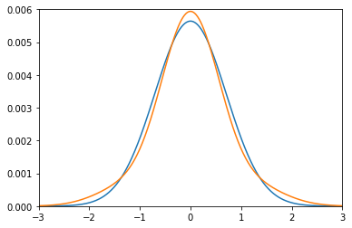
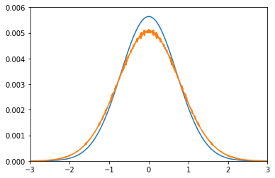

# TDSE-project

## Motivation

Solving the one-dimensional time dependent Schrodinger equation, for the simple case of a free-particle, using the finite differences method.

## Theory

#### The 1D TDSE 

<a href="https://www.codecogs.com/eqnedit.php?latex=i\hbar\frac{\partial&space;\psi(x,t)}{\partial&space;t}&space;=&space;-\frac{\hbar^2}{2m}\frac{\partial^2&space;\psi&space;(x,t)}{\partial&space;t^2}&space;&plus;&space;V(x,t)\psi(x,t)" target="_blank"></a>

#### The 1D TDSE for a free particle, setting:  <a href="https://www.codecogs.com/eqnedit.php?latex=\hbar&space;=&space;m&space;=&space;1" target="_blank"></a>

<a href="https://www.codecogs.com/eqnedit.php?latex=\frac{\partial&space;\psi(x,t)}{\partial&space;t}&space;=&space;\frac{i}{2}\frac{\partial^2&space;\psi&space;(x,t)}{\partial&space;t^2}" target="_blank"></a>

#### Approximating the derivative in space using a linear combination of third order taylor expansions for three neighboring points

<a href="https://www.codecogs.com/eqnedit.php?latex=\psi_{j-1}^n&space;=&space;\psi_j^n&space;-&space;\Delta&space;x&space;\frac{\partial&space;\psi_j^n}{\partial&space;x}&space;&plus;&space;\frac{\Delta&space;x^2}{2}\frac{\partial^2&space;\psi_j^n}{\partial&space;x^2}&space;&plus;&space;O(\Delta&space;x^3)" target="_blank"></a>

<a href="https://www.codecogs.com/eqnedit.php?latex=\psi_{j&plus;1}^n&space;=&space;\psi_j^n&space;&plus;&space;\Delta&space;x&space;\frac{\partial&space;\psi_j^n}{\partial&space;x}&space;&plus;&space;\frac{\Delta&space;x^2}{2}\frac{\partial^2&space;\psi_j^n}{\partial&space;x^2}&space;&plus;&space;O(\Delta&space;x^3)" target="_blank"></a>

<a href="https://www.codecogs.com/eqnedit.php?latex=\frac{\partial&space;\psi_j^n}{\partial&space;x^2}&space;=&space;\frac{\psi_{j-1}^n&space;-2&space;\psi_j^n&space;&plus;&space;\psi_{j&plus;1}^n}{\Delta&space;x^2}&space;&plus;&space;O(\Delta&space;x^3)" target="_blank"></a>

#### Approximating a finite step in time using a first order taylor expansion

<a href="https://www.codecogs.com/eqnedit.php?latex=\psi_j^{n&plus;1}&space;=&space;\psi_j^n&space;&plus;&space;\Delta&space;t&space;\frac{\partial&space;\psi_j^n}{\partial&space;t}&space;&plus;&space;O(\Delta&space;t^2)" target="_blank"></a>

<a href="https://www.codecogs.com/eqnedit.php?latex=\psi_j^{n&plus;1}&space;=&space;\psi_j^n&space;&plus;&space;\frac{i\Delta&space;t}{2}[\frac{\psi_{j&plus;1}^n&space;-&space;2\psi_j^n&space;&plus;&space;\psi_{j&plus;1}^n}{\Delta&space;x^2}]&space;&plus;&space;O(\Delta&space;t^2)" target="_blank"></a>

#### Approximating a finite step in time using a fourth order (Runge Kutta) approximation

<a href="https://www.codecogs.com/eqnedit.php?latex=\psi_j^{n&plus;1}&space;=&space;\psi_j^n&space;&plus;&space;\frac{k_1_j&space;&plus;&space;2&space;k_2_j&space;&plus;&space;2&space;k_3_j&space;&plus;&space;k_4_j}{6}" target="_blank"></a>

where:

<a href="https://www.codecogs.com/eqnedit.php?latex=k_1_j&space;=&space;\frac{i\Delta&space;t}{2}\frac{\partial^2}{\partial&space;x^2}\psi(x&space;,&space;t)" target="_blank"></a>

<a href="https://www.codecogs.com/eqnedit.php?latex=k_2_j&space;=&space;\frac{i\Delta&space;t}{2}\frac{\partial^2}{\partial&space;x^2}\psi(x&space;&plus;&space;\frac{k_1_j}{2},&space;t&space;&plus;&space;\frac{\Delta&space;t}{2})" target="_blank"></a>

<a href="https://www.codecogs.com/eqnedit.php?latex=k_3_j&space;=&space;\frac{i\Delta&space;t}{2}\frac{\partial^2}{\partial&space;x^2}\psi(x&space;&plus;&space;\frac{k_2_j}{2},&space;t&space;&plus;&space;\frac{\Delta&space;t}{2})" target="_blank"></a>

<a href="https://www.codecogs.com/eqnedit.php?latex=k_4_j&space;=&space;\frac{i\Delta&space;t}{2}\frac{\partial^2}{\partial&space;x^2}\psi(x&space;&plus;&space;k_3_j,&space;t&space;&plus;&space;\Delta&space;t)" target="_blank"></a>

## Importing libaries

```python
import math
import numpy as np
```

## Creating a gaussian shaped initial wavefunction

```python
def initial_wavefunction(a,x):
    return math.exp(-a * (x ** 2))
```

## Converting a wavefunction into a probability density function

```python
def probability_density(wavefunction):
    wavefunction = np.array(wavefunction)
    conjugate_wavefunction = np.conjugate(wavefunction)
    probability_density = wavefunction * conjugate_wavefunction
    return list(probability_density.real)
```

## Applying the normalisation condition to a probability density function

```python
def norm(pdf):
    total = np.sum(np.array(pdf))
    norm_pdf = []
    for point in pdf:
        point /= total
        norm_pdf.append(point)
    return norm_pdf
```   
    
## Defining the third order approximation for the time derivative


```python
def time_deriv(i, old_wf, delta_x):
    if i == 0:
        return complex(0,1) * ((0 - (2 * old_wf[i]) + old_wf[i+1])/(2 * (delta_x**2)))
    if i == (len(old_wf) - 1):
        return complex(0,1) * ((old_wf[i-1] - (2 * old_wf[i]) + 0)/(2 * (delta_x**2)))
    else:
        return complex(0,1) * ((old_wf[i-1] - (2 * old_wf[i]) + old_wf[i+1])/(2 * (delta_x**2)))
```

## Defining the first order approximation for a step in time

```python
def time_step_first_order(old_wf, delta_x, delta_t):
    new_wf = []
    for i in range(len(old_wf)):
        new_wf.append(old_wf[i] + (delta_t * time_deriv(i, old_wf, delta_x)))
    return new_wf
```

## Plotting the first order approximation for a step in time

```python
positions = [0.01 * i for i in range(-5000,5001)]

wf_initial = [initial_wf(0.5, x) for x in positions]
pdf_initial = norm(pdf(wf_initial))

wf_one_step = time_step_first_order(wf_initial, 0.01, 1)
pdf_one_step = norm(pdf(wf_one_step))

plt.plot(positions, pdf_initial, positions, pdf_one_step)
plt.axis([-3, 3, 0, 0.006])
```


## Defining the fourth order (Runge Kutta) approximation for a step in time

```python
def time_step_rk4(wf_initial, x_coords, delta_x, delta_t):
    k_1 = []
    k_2 = []
    k_3 = []
    k_4 = []
    wf_updated = []
    for i in range(len(x_coords)):
        k_1.append(delta_t * time_deriv(i, wf_initial, delta_x))
    for i in range(len(x_coords)):
        wf_updated.append(wf_initial[i] + (0.5 * k_1[i]))
    for i in range(len(x_coords)):
        k_2.append(delta_t * time_deriv(i, wf_updated, delta_x))
    for i in range(len(x_coords)):
        wf_updated[i] = wf_initial[i] + k_2[i]/2
    for i in range(len(x_coords)):
        k_3.append(delta_t * time_deriv(i, wf_updated, delta_x))
    for i in range(len(x_coords)):
        wf_updated[i] = wf_initial[i] + k_3[i]
    for i in range(len(x_coords)):
        k_4.append(delta_t * time_deriv(i, wf_updated, delta_x))
    for i in range(len(x_coords)):
        wf_updated[i] = wf_initial[i] + (k_1[i] + 2*(k_2[i] + k_3[i]) + k_4[i])/6
    return(wf_updated) 
```

## Plotting the fourth order approximation for a step in time

```python
positions = [(0.01 * i) for i in range(-5000,5001)]
wf_initial = [initial_wf(0.5, x) for x in positions]
pdf_initial = norm(pdf(wf_initial))
wf_one_step_2 = rk4(wf_initial, positions, 0.01, 0.5)
pdf_one_step_2 = norm(pdf(wf_one_step_2))
plt.plot(positions, pdf_initial, positions, pdf_one_step_2)
plt.axis([-3, 3, 0, 0.006])
```

